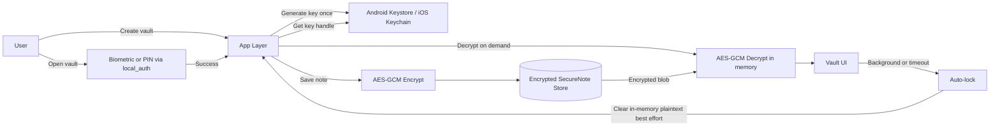

# NoteVault

Capture. Organize. Protect.

NoteVault is an offline-first Flutter notes app focused on fast capture, flexible organization, and secure vaults for sensitive information.

## Product Direction

- Fast and minimal note-taking flow
- Smart capture for text, checklists, and scanned documents
- Flexible organization with tags, pinning, and archive
- Encrypted vault area isolated from normal notes

## App Layout

The app is organized into two clear sections:

1. Normal Notes
2. Vault (locked and unlocked states)

Bottom navigation tabs:

- Notes
- Search
- Vault
- Settings

### Main Screens

1. Home / Notes List
2. Create Note (quick capture)
3. Note Open (rich text content)
4. Checklist Note
5. Scan Note (document capture)

## UX Flow

### High-Level Flow

1. Onboarding
2. Home (Notes)
3. Create Note
4. Organize (tags, pin, archive)
5. Search
6. Vault Locked
7. Vault Unlocked

### Normal Note Flow

1. Open notes list
2. Create or edit note
3. Add tags or pin
4. Archive/delete when needed
5. Find again through search

### Vault Flow

1. User enters Vault tab
2. Vault is locked by default
3. User authenticates with biometrics (PIN fallback)
4. Vault content becomes visible after successful auth
5. Vault auto-locks on timeout or app background

## Secure Vault Spec (Planned)

Vaults are intended for private data (password notes, personal records, sensitive text) and are fully separated from normal notes.

### Data Model

Vault:

- id: String
- name: String
- createdAt: DateTime
- isLocked: bool

SecureNote:

- id: String
- vaultId: String
- encryptedData: String (AES-GCM encrypted payload)
- createdAt: DateTime
- updatedAt: DateTime

### Security Model

- No raw passwords stored
- No custom crypto schemes
- No plain-text key storage
- Keys remain in platform secure storage

Platform APIs:

- Android: Keystore (hardware-backed when available)
- iOS: Keychain (Secure Enclave where available)
- Flutter auth: local_auth for biometric/PIN unlock

### Security Constraints

- No logs of decrypted content
- Best-effort memory cleanup after decryption use
- No note previews for locked vault content
- Optional screenshot/app switcher hardening

### Architecture Diagram (Compact)

## Feature Areas

### Note Types

- Text note
- Checklist note
- Image note
- Scan note
- Voice note (future)

### Organization

- Tags
- Pin
- Archive
- Color labels (future)

### Vault Security

- Hardware-backed encryption
- Biometric authentication
- Auto-lock
- Hidden previews for locked content

## Performance Targets

- Decrypt notes lazily (do not decrypt all at once)
- Keep per-note decrypt latency under 100ms on supported devices

## Non-Goals (Initial)

- No cloud sync for encrypted data
- No password manager/autofill behavior
- No custom encryption algorithms

## Definition of Done (Vault Milestone)

- User can create a vault
- User can unlock via biometrics/PIN
- User can store encrypted notes in vault
- User can lock manually and auto-lock works
- Vault data remains encrypted at rest
- Keys never leave secure platform storage
